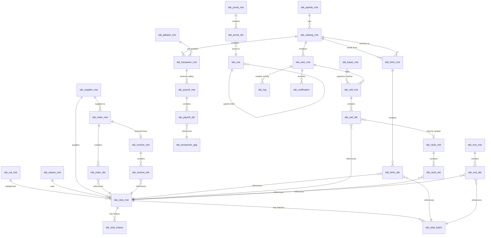

# 🧾 Software Requirements Specification (SRS)
## Aplikasi Apotek **MidaFarma**

---

## 📘 1. Pendahuluan

### 1.1 Tujuan Dokumen
Dokumen ini menjelaskan spesifikasi kebutuhan perangkat lunak (Software Requirements Specification / SRS) untuk **Aplikasi Apotek MidaFarma**.  
Tujuannya adalah menjadi acuan bagi tim pengembang, penguji, dan pengguna akhir untuk memastikan kesesuaian antara sistem yang dibangun dan kebutuhan bisnis apotek.

### 1.2 Ruang Lingkup Sistem
**MidaFarma** adalah grup apotek independen dengan **1 Gudang Pusat** dan **multiple Cabang Apotek**. Suite aplikasi berbasis **desktop Windows (Delphi 12 Community Edition + Supabase PostgreSQL + SQLite)** yang terdiri dari **6 aplikasi modular**:

#### **Struktur Organisasi:**
```
                    SUPPLIER
                       ↓
                  [GUDANG PUSAT]
                   (1 lokasi)
                       ↓
        ┌──────────────┼──────────────┐
        ↓              ↓              ↓
   [CABANG A]     [CABANG B]     [CABANG C]
   (Apotek)       (Apotek)       (Apotek)
        ↓              ↓              ↓
    KONSUMEN       KONSUMEN       KONSUMEN
```

#### **Aplikasi & Fungsi:**

**A. Aplikasi Gudang** (Digunakan di Gudang Pusat)
- Mengelola pembelian dari supplier (HANYA gudang yang beli ke supplier)
- Master data obat/non-obat (centralized)
- Stok gudang pusat
- Mutasi stok gudang
- Distribusi ke cabang

**B. Aplikasi Kirim** (Digunakan di Gudang & Cabang)
- **Di Gudang:** Kirim barang ke cabang
- **Di Cabang:** Kirim barang ke cabang lain (perlu approval manajer pusat)

**C. Aplikasi Terima** (Digunakan di Gudang & Cabang)
- **Di Gudang:** Terima barang dari supplier
- **Di Cabang:** Terima barang dari gudang atau cabang lain

**D. Aplikasi Kasir** (Digunakan di Cabang)
- Transaksi penjualan obat ke konsumen (tunai/transfer/QRIS)
- Racikan obat
- Cetak nota
- Retur penjualan

**E. Aplikasi Payroll** (Digunakan di Kantor Pusat)
- Mengelola penggajian seluruh karyawan grup
- Data karyawan gudang & semua cabang

**F. Aplikasi Akuntansi** (Digunakan di Setiap Cabang & Gudang - Independen)
- **Setiap cabang:** Pembukuan independen, laporan keuangan per cabang
- **Gudang:** Pembukuan operasional gudang
- Konsolidasi laporan (opsional untuk owner)

**Arsitektur Database:**
- **Database Utama:** Supabase (PostgreSQL) — online/cloud
- **Database Lokal:** SQLite — backup otomatis saat offline
- **Sinkronisasi:** Otomatis saat koneksi internet tersedia

**Prinsip Operasional:**
1. **Pembelian:** HANYA gudang pusat yang berhubungan dengan supplier
2. **Master Data:** Centralized di gudang, sync ke semua cabang (read-only untuk cabang)
3. **Distribusi:** Gudang → Cabang (normal flow)
4. **Transfer Antar Cabang:** Cabang ↔ Cabang (perlu approval manajer pusat)
5. **Pelaporan Keuangan:** Independen per cabang (tidak consolidated di aplikasi)

---

## 📗 2. Deskripsi Umum

### 2.1 Perspektif Sistem
Aplikasi bersifat **modular** dengan 6 aplikasi desktop terpisah yang terhubung ke **database cloud (Supabase)** dengan **fallback ke SQLite lokal**.  
Sistem mengikuti pola *hybrid cloud-local architecture*.

**Komponen utama:**
1. **Front-End:** Delphi 12 Community Edition form-based UI  
2. **Back-End Utama:** Supabase (PostgreSQL) — database cloud  
3. **Back-End Lokal:** SQLite — database backup lokal  
4. **Komponen koneksi:** 
   - FireDAC (Supabase/PostgreSQL via REST API atau libpq)
   - FireDAC SQLite driver untuk database lokal
5. **Sinkronisasi:** Background service untuk sync data online ↔ offline

**Arsitektur Aplikasi:**
- Setiap modul (Gudang, Kirim, Terima, Kasir, Payroll, Akuntansi) adalah executable terpisah
- Shared components untuk koneksi database dan business logic
- Automatic fallback ke SQLite saat internet tidak tersedia
- Queue system untuk sinkronisasi data saat kembali online

---

### 2.2 Fitur Utama

#### **A. Aplikasi Gudang** (Lokasi: Gudang Pusat)
1. **Pembelian dari Supplier**
   - Input PO (Purchase Order)
   - Tracking faktur supplier
   - Update stok otomatis setelah penerimaan
2. **Master Data** (Centralized)
   - Master obat/non-obat (sync ke semua cabang)
   - Kategori produk
   - Supplier
   - Satuan
3. **Stok Gudang**
   - Monitoring stok gudang pusat
   - Mutasi stok (koreksi, expired, rusak)
   - Stock opname gudang
4. **Distribusi ke Cabang**
   - Request dari cabang
   - Alokasi barang ke cabang
   - Tracking pengiriman
5. **Laporan Gudang**
   - Laporan pembelian
   - Laporan stok gudang
   - Laporan distribusi ke cabang
   - Laporan mutasi

#### **B. Aplikasi Kirim** (Lokasi: Gudang & Cabang)

**Di Gudang Pusat:**
1. Kirim barang ke cabang (berdasarkan request atau inisiatif)
2. Surat jalan
3. Tracking pengiriman
4. Update stok gudang (OUT)

**Di Cabang:**
1. Request transfer ke cabang lain (perlu approval manajer pusat)
2. Kirim barang ke cabang lain (setelah diapprove)
3. Tracking status transfer
4. Update stok cabang (OUT)

#### **C. Aplikasi Terima** (Lokasi: Gudang & Cabang)

**Di Gudang Pusat:**
1. Penerimaan barang dari supplier (link ke PO)
2. Validasi fisik vs dokumen
3. Input batch & expired date
4. Update stok gudang (IN)
5. Handling discrepancy

**Di Cabang:**
1. Penerimaan barang dari gudang
2. Penerimaan barang dari cabang lain
3. Validasi fisik
4. Update stok cabang (IN)
5. Konfirmasi penerimaan
6. Pengembalian barang ke gudang (retur/expired)

#### **D. Aplikasi Kasir** (Lokasi: Cabang - Digunakan oleh Kasir)
1. **Transaksi Penjualan**
   - Input manual atau scan barcode
   - Multiple payment method (tunai/transfer/QRIS/debit/credit)
   - Diskon per item & per transaksi
   - Cetak nota/struk thermal
2. **Racikan Obat**
   - Input komposisi racikan
   - Template racikan
   - Harga otomatis
   - Label racikan
3. **Retur Penjualan**
   - Input retur (perlu approval manajer cabang)
   - Update stok cabang
4. **Laporan Kasir**
   - Laporan penjualan per shift
   - History transaksi

#### **E. Aplikasi Payroll** (Lokasi: Kantor Pusat)
1. **Master Data Karyawan**
   - Data karyawan gudang
   - Data karyawan semua cabang
   - Jabatan & struktur gaji
2. **Perhitungan Gaji**
   - Input absensi
   - Perhitungan gaji bulanan
   - Tunjangan & potongan
   - Slip gaji
3. **Laporan Payroll**
   - Rekap gaji per cabang/gudang
   - Rekap gaji grup
   - Export untuk transfer bank

#### **F. Aplikasi Akuntansi** (Lokasi: Setiap Cabang & Gudang - Independen)

**Prinsip:** Setiap entitas (gudang & masing-masing cabang) memiliki pembukuan INDEPENDEN

**Di Setiap Cabang:**
1. Chart of Accounts (COA) per cabang
2. Jurnal otomatis dari transaksi penjualan
3. Jurnal manual (biaya operasional cabang)
4. Buku besar per cabang
5. Laporan keuangan per cabang:
   - Neraca saldo
   - Laba rugi cabang
   - Neraca cabang
   - Arus kas cabang
6. Closing periode per cabang

**Di Gudang:**
1. COA untuk operasional gudang
2. Jurnal pembelian & biaya gudang
3. Laporan keuangan operasional gudang

**Di Kantor Pusat (Opsional - Manual Consolidation):**
- View laporan keuangan semua entitas
- Export untuk konsolidasi manual (di luar aplikasi)

#### **Fitur Lintas Aplikasi**
1. **Login & Manajemen User** — Authentication dengan role-based access
2. **Sinkronisasi Database** — Otomatis cloud ↔ lokal
3. **Logging Aktivitas** — Audit trail untuk semua transaksi
4. **Notifikasi** — Alert untuk:
   - Stok minimum cabang
   - Expired alert
   - Request approval (transfer antar cabang)
   - Request barang dari cabang
5. **Backup & Restore** — Otomatis dan manual
6. **Master Data Sync** — Master obat dari gudang sync ke semua cabang (read-only di cabang)

---

### 2.3 Jenis Pengguna dan Hak Akses

| Jenis User | Lokasi | Aplikasi yang Dapat Diakses | Hak Akses |
|-------------|--------|------------------------------|-----------|
| **Owner/Pemilik** | Pusat | Semua aplikasi (read-only untuk transaksi) | View semua laporan, dashboard konsolidasi, approval besar |
| **Manajer Pusat** | Pusat/Gudang | Gudang, Kirim, Terima, Payroll | Full akses gudang, approval distribusi, approval transfer antar cabang, payroll |
| **Staff Gudang** | Gudang | Gudang, Terima, Kirim | Input pembelian supplier, penerimaan, mutasi stok, kirim ke cabang |
| **Manajer Cabang** | Cabang | Terima, Kirim, Kasir (view), Akuntansi | - Permintaan barang ke gudang<br>- Penerimaan barang<br>- Pengembalian barang ke gudang<br>- Transfer ke cabang lain (perlu approval pusat)<br>- Stock opname<br>- Laporan keuangan cabang<br>- View laporan penjualan<br>- Approval retur penjualan |
| **Kasir Cabang** | Cabang | Kasir | - Transaksi penjualan<br>- Racikan obat<br>- Cetak nota<br>- Retur (dengan approval manajer) |
| **Staff Keuangan Pusat** | Pusat | Payroll, Akuntansi | Payroll processing, view laporan keuangan semua entitas |
| **IT Admin** | Pusat | Semua aplikasi | Konfigurasi sistem, user management, backup/restore |

**Catatan Penting:**
- **Kasir:** TIDAK bisa melakukan permintaan/penerimaan/pengembalian barang
- **Manajer Cabang:** Fokus pada operasional, inventory, dan pelaporan cabang
- **Transfer Antar Cabang:** Manajer cabang bisa request, tapi perlu approval Manajer Pusat
- **Master Data Obat:** Read-only di cabang, hanya gudang yang bisa edit

---

### 2.4 Keterbatasan
- Aplikasi berbasis desktop Windows (tidak cross-platform)  
- Memerlukan koneksi internet untuk operasi optimal (fallback ke SQLite saat offline)  
- Sinkronisasi data offline memerlukan waktu saat kembali online  
- Laporan real-time multi-cabang bergantung pada koneksi internet  
- Integrasi payment gateway (QRIS) memerlukan internet  
- Tidak mendukung mobile app (tablet/smartphone) pada fase awal  

---

## 📘 3. Kebutuhan Fungsional

### 3.1 Modul Login & Autentikasi
- **Single Sign-On (SSO)** untuk semua aplikasi
- Validasi user dari database Supabase (`tab_user_mst`)
- Token-based authentication dengan refresh token
- Akses aplikasi berdasarkan role dan permission
- Logging aktivitas login/logout dengan IP address dan device info
- Session management dengan auto-logout setelah periode inaktif
- Password encryption dengan bcrypt atau Argon2

### 3.2 Modul Master Data (Aplikasi Gudang - Gudang Pusat Only)

**Prinsip:** Master data HANYA dapat di-edit di Gudang Pusat, kemudian di-sync ke semua cabang sebagai read-only.

- **CRUD untuk (di Gudang):**
  - `tab_obat_mst` — Master obat (kode, nama, kategori, satuan, harga)
  - `tab_cat_mst` — Kategori obat
  - `tab_supplier_mst` — Data supplier
  - `tab_satuan_mst` — Satuan obat (box, strip, tablet, ml, dll)
  - `tab_apotek_mst` — Identitas apotek pusat
  - `tab_cabang_mst` — Data cabang apotek

- **Read-only di Cabang:**
  - Cabang hanya bisa VIEW master obat, tidak bisa tambah/edit/delete
  - Master data di-sync otomatis dari gudang ke cabang
  - Cabang bisa search & filter master data untuk transaksi

- **Fitur tambahan:**
  - Import data obat dari Excel/CSV (hanya di gudang)
  - Barcode generation untuk obat
  - Tracking obat expired
  - Multi-pricing (harga beli, jual resep, jual umum)
  - History perubahan harga

- **User Management (Central):**
  - `tab_user_mst` — Kelola user gudang & semua cabang
  - Assign user ke cabang tertentu
  - Role-based access control

### 3.3 Modul Pembelian (Aplikasi Gudang - Gudang Pusat Only)

**Prinsip:** HANYA Gudang Pusat yang melakukan pembelian dari supplier. Cabang TIDAK bisa beli langsung dari supplier.

- Input faktur pembelian dari supplier  
- Tabel: `tab_order_mst`, `tab_order_det`  
- Upload foto/scan faktur
- Multi-satuan pembelian (conversion factor)
- Update stok GUDANG otomatis (IN) setelah penerimaan
- Generate jurnal otomatis ke Aplikasi Akuntansi Gudang
- Approval workflow untuk pembelian di atas limit tertentu
- Tracking status pembelian (draft, approved, received, completed)

**Flow Pembelian:**
1. Staff Gudang input PO
2. Manajer Pusat approve (jika perlu)
3. Kirim PO ke supplier
4. Supplier kirim barang + faktur
5. Gudang terima barang (via Aplikasi Terima)
6. Update stok gudang (IN)
7. Jurnal pembelian tercatat di akuntansi gudang

### 3.4 Modul Penerimaan Barang (Aplikasi Terima)

#### **A. Di Gudang Pusat**
- Penerimaan dari supplier berdasarkan PO (Purchase Order)
- Validasi fisik barang vs dokumen PO
- Scan barcode untuk verifikasi
- Input batch number dan expired date
- Tabel: `tab_receive_mst`, `tab_receive_det`
- Update stok GUDANG otomatis setelah approval (IN)
- Generate laporan penerimaan barang
- Handling discrepancy (selisih barang)

#### **B. Di Cabang**
- Penerimaan barang dari gudang pusat
- Penerimaan barang dari cabang lain (jika ada transfer)
- Validasi fisik barang vs surat jalan
- Scan barcode untuk verifikasi
- Update stok CABANG otomatis (IN)
- Konfirmasi penerimaan ke pengirim
- **Pengembalian barang ke gudang:**
  - Barang rusak/expired di cabang
  - Barang tidak sesuai
  - Barang over stock (return)
  - Input alasan pengembalian
  - Perlu approval manajer cabang

**Tabel:** `tab_receive_mst`, `tab_receive_det` dengan field `receive_from_type` (supplier/gudang/cabang)

### 3.5 Modul Pengiriman (Aplikasi Kirim)

#### **A. Di Gudang Pusat**
- **Kirim ke Cabang (Normal Distribution):**
  - Berdasarkan request dari cabang
  - Atau inisiatif gudang (stock replenishment)
  - Pilih cabang tujuan
  - Pilih obat & qty
  - Generate surat jalan
  - Update stok gudang (OUT)
  - Tracking status pengiriman
  - Konfirmasi delivered setelah cabang terima

- Tabel: `tab_kirim_mst`, `tab_kirim_det`
- Scan barcode obat untuk validasi
- Cetak surat jalan
- Upload bukti pengiriman

#### **B. Di Cabang**
- **Request Barang ke Gudang:**
  - Manajer cabang input request
  - Status: pending → diproses gudang → dikirim → diterima
  - Tracking status request

- **Transfer ke Cabang Lain (Special Case):**
  - Manajer cabang submit request transfer ke cabang lain
  - **PERLU APPROVAL MANAJER PUSAT** (mandatory)
  - Jika diapprove:
    - Cabang pengirim buat surat jalan
    - Update stok cabang pengirim (OUT)
    - Cabang penerima terima via Aplikasi Terima
    - Update stok cabang penerima (IN)
  - Jika ditolak:
    - Request dibatalkan
    - Notifikasi ke manajer cabang peminta

**Flow Transfer Antar Cabang:**
```
Cabang A (Manajer) → Request Transfer ke Cabang B
         ↓
Manajer Pusat → Review & Approve/Reject
         ↓
     Approved → Cabang A kirim ke Cabang B
         ↓
Cabang B → Terima barang (via Aplikasi Terima)
```

**Tabel:** `tab_kirim_mst` dengan field:
- `from_location_type` (gudang/cabang)
- `to_location_type` (cabang)
- `approval_status` (pending/approved/rejected)
- `approved_by` (user_id manajer pusat)
- `approval_notes`

### 3.6 Modul Penjualan (Aplikasi Kasir - Cabang Only)

**Prinsip:** Penjualan HANYA dilakukan di cabang oleh kasir. Gudang tidak melakukan penjualan retail.

- Transaksi jual: tunai, transfer, QRIS, debit/credit card  
- Tabel: `tab_sell_mst`, `tab_sell_det`  
- Auto numbering per cabang via `tab_generator`  
- Update stok CABANG (OUT) real-time
- Resep dokter (input no. resep, nama dokter, nama pasien)
- Diskon per item dan per transaksi
- **Retur penjualan:**
  - Input retur
  - **PERLU APPROVAL MANAJER CABANG** (mandatory)
  - Update stok cabang (IN)
  - Refund ke customer
- Cetak nota/struk thermal printer
- Generate jurnal otomatis ke Aplikasi Akuntansi CABANG
- Customer display untuk kasir (opsional)
- Integration dengan EDC untuk payment (opsional)

**Flow Penjualan:**
1. Kasir login
2. Input/scan obat
3. Sistem cek stok cabang (bukan stok gudang)
4. Hitung total
5. Pilih metode pembayaran
6. Simpan transaksi
7. Update stok cabang (OUT)
8. Generate jurnal di akuntansi cabang
9. Cetak nota
10. Log aktivitas

**Flow Retur:**
1. Customer bawa nota & barang
2. Kasir input retur
3. Submit approval ke manajer cabang
4. Manajer cabang approve/reject
5. Jika approved:
   - Update stok cabang (IN)
   - Refund ke customer
   - Generate jurnal retur di akuntansi cabang

### 3.7 Modul Racikan (Aplikasi Kasir - Cabang Only)

**Prinsip:** Racikan dilakukan di cabang saat transaksi penjualan.

- Simpan komposisi racikan (`tab_racik_mst`, `tab_racik_det`)  
- Hitung harga otomatis berdasarkan komposisi obat
- **Racikan template:**
  - Manajer cabang bisa buat template racikan (resep standar)
  - Template bisa digunakan berulang oleh kasir
  - Template sync antar cabang (opsional)
- **Racikan custom per transaksi:**
  - Kasir buat racikan on-the-fly sesuai resep dokter
  - Pilih obat komposisi dari stok cabang
  - Input qty per obat
  - Sistem validasi stok tersedia
  - Hitung harga otomatis
- Label printing untuk racikan
- Update stok obat komposisi otomatis (OUT dari stok cabang)
- Tracking racikan per dokter/pasien

**Flow Racikan:**
1. Kasir pilih "Racikan" saat transaksi
2. Pilih template atau buat custom
3. Input komposisi (obat + qty)
4. Sistem validasi stok cabang
5. Hitung harga total racikan
6. Tambahkan ke transaksi
7. Cetak label racikan
8. Update stok masing-masing obat komposisi

### 3.8 Modul Mutasi Stok

#### **A. Di Gudang (Aplikasi Gudang)**
- Mutasi manual stok gudang: expired, rusak, hilang, koreksi
- Stock opname gudang
- Tabel: `tab_mut_mst`, `tab_mut_det`  
- Approval workflow untuk mutasi di atas threshold
- Alasan mutasi (mandatory)
- Upload foto bukti (untuk rusak/expired)
- Generate jurnal adjustment ke Aplikasi Akuntansi Gudang
- Laporan selisih stok gudang

#### **B. Di Cabang (Manajer Cabang)**
- Mutasi manual stok cabang: expired, rusak, hilang, koreksi
- **Stock opname cabang:**
  - Manajer cabang lakukan perhitungan fisik
  - Input hasil perhitungan fisik
  - Sistem compare dengan stok sistem
  - Generate selisih
  - Approval otomatis atau manual (jika selisih besar)
  - Update stok cabang
- Alasan mutasi (mandatory)
- Upload foto bukti
- Generate jurnal adjustment ke Aplikasi Akuntansi CABANG
- Laporan selisih stok cabang

**Catatan:** Kasir TIDAK bisa melakukan mutasi stok atau stock opname.

### 3.9 Modul Payroll (Aplikasi Payroll - Kantor Pusat)

**Prinsip:** Payroll untuk SEMUA karyawan (gudang + semua cabang) dikelola terpusat di kantor pusat.

- **Master Data:**
  - `tab_karyawan_mst` — Data karyawan gudang & semua cabang
  - `tab_jabatan_mst` — Master jabatan (Kasir Cabang, Manajer Cabang, Staff Gudang, dll)
  - `tab_komponen_gaji` — Komponen gaji (gaji pokok, tunjangan, potongan)
  
- **Transaksi:**
  - `tab_payroll_mst`, `tab_payroll_det` — Perhitungan gaji bulanan
  - Input absensi/kehadiran per karyawan per cabang
  - Perhitungan lembur
  - Perhitungan bonus/insentif (bisa based on kinerja cabang)
  - Potongan (BPJS, pajak, pinjaman, dll)
  
- **Output:**
  - Slip gaji (print/PDF/email) per karyawan
  - Rekap gaji per cabang
  - Rekap gaji grup (total semua lokasi)
  - Export untuk transfer bank
  - Generate jurnal gaji ke:
    - Akuntansi Gudang (untuk karyawan gudang)
    - Akuntansi masing-masing Cabang (untuk karyawan cabang)

**Catatan:** Biaya gaji dicatat sebagai beban operasional di entitas masing-masing (gudang atau cabang).

### 3.10 Modul Akuntansi (Aplikasi Akuntansi)

**PRINSIP PENTING:** Setiap entitas (Gudang & masing-masing Cabang) memiliki pembukuan yang **INDEPENDEN**. Tidak ada konsolidasi otomatis di aplikasi.

#### **A. Di Gudang Pusat**
- **Chart of Accounts (COA) Gudang:**
  - `tab_coa` — Akun untuk operasional gudang
  - Contoh: Persediaan Barang Gudang, Biaya Operasional Gudang, Utang Supplier, dll
  
- **Jurnal Gudang:**
  - `tab_jurnal_mst`, `tab_jurnal_det`
  - **Jurnal otomatis dari:**
    - Pembelian dari supplier (Persediaan ↑, Utang ↑)
    - Distribusi ke cabang (Persediaan ↓, Piutang Cabang ↑)
    - Biaya gaji karyawan gudang (dari Payroll)
    - Mutasi stok gudang
  - **Jurnal manual:**
    - Biaya operasional gudang lainnya
    - Pembayaran utang supplier
    - Penerimaan dari cabang
    
- **Laporan Keuangan Gudang:**
  - Neraca saldo gudang
  - Laba rugi operasional gudang
  - Neraca gudang
  - Arus kas gudang

#### **B. Di Setiap Cabang**
- **Chart of Accounts (COA) Cabang:**
  - `tab_coa` — Akun untuk operasional cabang
  - Contoh: Persediaan Obat Cabang, Pendapatan Penjualan, Biaya Operasional Cabang, Utang ke Gudang, dll
  
- **Jurnal Cabang:**
  - `tab_jurnal_mst`, `tab_jurnal_det`
  - **Jurnal otomatis dari:**
    - Penjualan (Kas/Bank ↑, Pendapatan ↑, HPP ↑, Persediaan ↓)
    - Retur penjualan (kebalikan penjualan)
    - Penerimaan barang dari gudang (Persediaan ↑, Utang ke Gudang ↑)
    - Pengembalian barang ke gudang (Persediaan ↓, Utang ke Gudang ↓)
    - Biaya gaji karyawan cabang (dari Payroll)
    - Mutasi stok cabang
  - **Jurnal manual:**
    - Biaya sewa
    - Biaya listrik & air
    - Biaya operasional lainnya
    - Pembayaran ke gudang
    
- **Laporan Keuangan Cabang (INDEPENDEN):**
  - Neraca saldo cabang
  - **Laba rugi cabang** (revenue & expense cabang sendiri)
  - **Neraca cabang** (asset, liability, equity cabang sendiri)
  - Arus kas cabang
  - Aging hutang ke gudang

#### **C. Di Kantor Pusat (View Only - Manual Consolidation)**
- **Dashboard Owner:**
  - View laporan keuangan semua entitas (gudang + semua cabang)
  - Perbandingan performa antar cabang
  - **TIDAK ada auto-consolidation** dalam aplikasi
  - Export data untuk konsolidasi manual di Excel (jika diperlukan)

#### **D. Fitur Umum Akuntansi**
- Multi-level COA (header dan detail)
- Validasi balanced debit-credit
- Closing periode bulanan per entitas
- Closing tahunan per entitas
- Transfer laba/rugi ke retained earnings
- Backup & archive data lama
- Export laporan ke Excel/PDF

**Catatan:** 
- Setiap cabang bertanggung jawab atas laporan keuangannya sendiri
- Manajer cabang dapat melihat & print laporan keuangan cabangnya
- Owner dapat view semua laporan untuk evaluasi performa grup

### 3.11 Modul Laporan & Histori (Semua Aplikasi)
- Dashboard dengan KPI dan grafik
- Laporan penjualan (harian, bulanan, tahunan)
- Laporan pembelian
- Laporan stok (current, movement, expired alert)
- Laporan mutasi
- Laporan racikan
- Laporan payroll
- Laporan keuangan (full financial statements)
- Log aktivitas user (audit trail)
- Export laporan ke Excel, PDF, CSV

### 3.12 Modul Pengaturan (Super Admin)
- **Setting koneksi database:**
  - Supabase (URL, API Key, Service Role Key)
  - SQLite (path lokal)
  - Test koneksi
- **Setting sinkronisasi:**
  - Interval sync otomatis
  - Manual sync trigger
  - Conflict resolution strategy
- **Setting aplikasi:**
  - Identitas apotek per cabang
  - Auto-number format per modul
  - Printer settings (thermal, A4)
  - Email/SMS notification settings
  - Backup schedule
- **User & Role Management:**
  - CRUD user
  - Role-based access control (RBAC)
  - Permission matrix
  - Password policy  

---

## 📗 4. Kebutuhan Non-Fungsional

| Kategori | Kebutuhan | Keterangan |
|-----------|-----------|------------|
| **Kinerja** | • ≥ 2000 transaksi/hari per aplikasi<br>• Response time < 2 detik untuk transaksi lokal<br>• Response time < 5 detik untuk sync ke cloud<br>• Support concurrent users: 20 user simultan | Optimasi query dan indexing database |
| **Keamanan** | • Password hashing (bcrypt/Argon2)<br>• Token-based authentication (JWT)<br>• Role-based access control (RBAC)<br>• Encrypted connection ke Supabase (SSL/TLS)<br>• Audit trail lengkap<br>• Data encryption at rest untuk SQLite<br>• Regular security updates | Compliance dengan regulasi kesehatan dan privasi data |
| **Reliabilitas** | • Database Supabase: 99.9% uptime<br>• Automatic failover ke SQLite saat offline<br>• Transaction rollback pada error<br>• Data integrity constraints<br>• Automatic backup Supabase: daily<br>• Local backup SQLite: setiap 6 jam | Zero data loss pada normal operation |
| **Availability** | • Aplikasi tetap berjalan saat offline (mode offline)<br>• Auto-sync saat koneksi kembali<br>• Queue management untuk pending transactions<br>• Graceful degradation saat cloud unavailable | Business continuity terjaga |
| **Usability** | • Antarmuka intuitif dan user-friendly<br>• Konsisten antar aplikasi (common UI/UX pattern)<br>• Keyboard shortcuts untuk operasi cepat<br>• Visual feedback untuk setiap aksi<br>• Error messages yang informatif<br>• Help documentation dan tooltips | Minimal training requirement |
| **Portabilitas** | • Windows 10/11 (64-bit)<br>• Minimum screen resolution: 1366x768<br>• Support touchscreen (opsional) | Future: Linux/Mac compatibility |
| **Maintainability** | • Modular architecture (separation of concerns)<br>• Clean code practices<br>• Comprehensive logging<br>• Version control (Git)<br>• Documentation (inline & external)<br>• Unit tests untuk business logic | Mudah maintenance dan enhancement |
| **Scalability** | • Support multiple branches (multi-tenancy di Supabase)<br>• Horizontal scaling via cloud<br>• Database partitioning untuk data historis<br>• Archive old data (> 2 tahun) | Growth-ready architecture |
| **Interoperability** | • RESTful API untuk integrasi eksternal<br>• Standard data format (JSON/XML)<br>• Export/import data (Excel, CSV)<br>• Integration dengan payment gateway<br>• Integration dengan BPJS (future) | Ecosystem compatibility |
| **Compliance** | • Sesuai dengan regulasi apotek Indonesia<br>• Data retention policy<br>• GDPR-ready (personal data protection)<br>• Audit-ready (complete trail) | Legal compliance |

---

## 📘 5. Struktur Database

### 5.1 Arsitektur Database Hybrid

**A. Database Utama (Supabase - PostgreSQL)**
- Hosting: Cloud (Supabase)
- Fungsi: Primary database untuk semua aplikasi
- Akses: Via REST API atau Direct Connection (libpq)
- Features: Real-time subscriptions, Row Level Security (RLS), automatic backup

**B. Database Lokal (SQLite)**
- Lokasi: Lokal di setiap mesin aplikasi
- Fungsi: Cache dan backup saat offline
- Sinkronisasi: Bidirectional sync dengan Supabase
- Structure: Mirror structure dari Supabase

**C. Mekanisme Sinkronisasi**
```
1. Setiap transaksi → Simpan ke SQLite lokal dulu (fast)
2. Background service → Sync ke Supabase (async)
3. Conflict detection → Last-write-wins atau custom rule
4. Sync queue table → Track pending sync items
5. Sync log → Audit trail sinkronisasi
```

### 5.2 Tabel Master Data

#### **tab_apotek_mst** — Identitas Apotek/Cabang
| Field | Type | Description |
|-------|------|-------------|
| apt_id | VARCHAR(20) PK | Kode apotek/cabang |
| apt_name | VARCHAR(100) | Nama apotek |
| address | TEXT | Alamat lengkap |
| phone | VARCHAR(20) | Telepon |
| email | VARCHAR(100) | Email |
| npwp | VARCHAR(30) | NPWP apotek |
| sia_number | VARCHAR(50) | Nomor SIA (Surat Izin Apotek) |
| apoteker_name | VARCHAR(100) | Nama apoteker penanggung jawab |
| sipa_number | VARCHAR(50) | Nomor SIPA apoteker |
| is_active | BOOLEAN | Status aktif |
| created_at | TIMESTAMP | Waktu dibuat |
| updated_at | TIMESTAMP | Waktu update |

#### **tab_cabang_mst** — Data Cabang (untuk multi-branch)
| Field | Type | Description |
|-------|------|-------------|
| cabang_id | SERIAL PK | ID cabang |
| cabang_code | VARCHAR(10) UNIQUE | Kode cabang |
| cabang_name | VARCHAR(100) | Nama cabang |
| apt_id | VARCHAR(20) FK | Reference ke apotek |
| address | TEXT | Alamat |
| phone | VARCHAR(20) | Telepon |
| pic_name | VARCHAR(100) | Person in charge (Manajer Cabang) |
| is_gudang_pusat | BOOLEAN | TRUE jika ini gudang pusat, FALSE untuk cabang |
| is_active | BOOLEAN | Status aktif |
| created_at | TIMESTAMP | Waktu dibuat |
| updated_at | TIMESTAMP | Waktu update |

**Catatan:** Gudang pusat juga tercatat sebagai 1 cabang dengan `is_gudang_pusat = TRUE`

#### **tab_cat_mst** — Kategori Obat
| Field | Type | Description |
|-------|------|-------------|
| category_id | SERIAL PK | ID kategori |
| category_code | VARCHAR(10) UNIQUE | Kode kategori |
| category_name | VARCHAR(100) | Nama kategori |
| description | TEXT | Deskripsi |
| is_active | BOOLEAN | Status aktif |
| created_at | TIMESTAMP | Waktu dibuat |

#### **tab_satuan_mst** — Satuan Obat
| Field | Type | Description |
|-------|------|-------------|
| satuan_id | SERIAL PK | ID satuan |
| satuan_code | VARCHAR(10) UNIQUE | Kode satuan |
| satuan_name | VARCHAR(50) | Nama satuan (box, strip, tablet, ml, dll) |
| is_active | BOOLEAN | Status aktif |

#### **tab_obat_mst** — Master Obat
| Field | Type | Description |
|-------|------|-------------|
| obt_id | SERIAL PK | ID obat |
| obt_code | VARCHAR(20) UNIQUE | Kode obat |
| obt_name | VARCHAR(200) | Nama obat |
| obt_generic_name | VARCHAR(200) | Nama generik |
| category_id | INT FK | Kategori obat |
| satuan_id | INT FK | Satuan terkecil |
| barcode | VARCHAR(50) | Barcode obat |
| golongan | VARCHAR(20) | Golongan obat (bebas/bebas terbatas/keras/narkotika) |
| harga_beli | DECIMAL(15,2) | Harga beli terakhir |
| harga_jual_umum | DECIMAL(15,2) | Harga jual umum |
| harga_jual_resep | DECIMAL(15,2) | Harga jual resep |
| harga_jual_netto | DECIMAL(15,2) | Harga jual netto |
| margin_percent | DECIMAL(5,2) | Margin persen |
| stok_min | INT | Stok minimum (global/default) |
| pabrik | VARCHAR(100) | Nama pabrik |
| supplier_id | INT FK | Supplier utama |
| is_resep | BOOLEAN | Apakah obat resep |
| is_racikan | BOOLEAN | Apakah bisa diracik |
| is_active | BOOLEAN | Status aktif |
| created_at | TIMESTAMP | Waktu dibuat |
| updated_at | TIMESTAMP | Waktu update |
| created_by | INT FK | User pembuat |
| updated_by | INT FK | User update |

**CATATAN PENTING:** 
- Master obat ini adalah data CENTRALIZED (edit hanya di gudang)
- TIDAK ada field `stok_current` di sini
- Stok ACTUAL per lokasi disimpan di tabel `tab_stok_per_cabang`

#### **tab_stok_per_cabang** — Stok Per Lokasi (Gudang & Cabang)
| Field | Type | Description |
|-------|------|-------------|
| stok_id | SERIAL PK | ID stok |
| obt_id | INT FK | ID obat |
| cabang_id | INT FK | ID cabang (termasuk gudang) |
| batch_id | INT FK | ID batch (opsional, untuk tracking batch per lokasi) |
| qty_available | INT | Qty tersedia |
| stok_min | INT | Stok minimum untuk lokasi ini |
| updated_at | TIMESTAMP | Waktu update terakhir |

**Composite Unique Key:** (obt_id, cabang_id, batch_id)

**Catatan:**
- Setiap lokasi (gudang + cabang) punya stok sendiri
- Query stok: `SELECT qty_available FROM tab_stok_per_cabang WHERE obt_id = X AND cabang_id = Y`
- Update stok otomatis saat transaksi (IN/OUT)

#### **tab_obat_batch** — Batch dan Expired Obat
| Field | Type | Description |
|-------|------|-------------|
| batch_id | SERIAL PK | ID batch |
| obt_id | INT FK | ID obat |
| batch_number | VARCHAR(50) | Nomor batch |
| expired_date | DATE | Tanggal expired |
| qty_in_stock | INT | Qty tersisa |
| receive_date | DATE | Tanggal penerimaan |
| harga_beli | DECIMAL(15,2) | Harga beli batch ini |
| is_expired | BOOLEAN | Status expired |
| created_at | TIMESTAMP | Waktu dibuat |

#### **tab_supplier_mst** — Data Supplier
| Field | Type | Description |
|-------|------|-------------|
| supplier_id | SERIAL PK | ID supplier |
| supplier_code | VARCHAR(20) UNIQUE | Kode supplier |
| supplier_name | VARCHAR(100) | Nama supplier |
| address | TEXT | Alamat |
| phone | VARCHAR(20) | Telepon |
| email | VARCHAR(100) | Email |
| pic_name | VARCHAR(100) | Contact person |
| pic_phone | VARCHAR(20) | Telepon CP |
| payment_term | INT | Term pembayaran (hari) |
| is_active | BOOLEAN | Status aktif |
| created_at | TIMESTAMP | Waktu dibuat |
| updated_at | TIMESTAMP | Waktu update |

#### **tab_bayar_mst** — Metode Pembayaran
| Field | Type | Description |
|-------|------|-------------|
| pay_id | SERIAL PK | ID metode bayar |
| pay_code | VARCHAR(10) UNIQUE | Kode |
| pay_name | VARCHAR(50) | Nama (Tunai, Transfer, QRIS, Debit, Credit) |
| account_number | VARCHAR(50) | Nomor rekening (untuk transfer) |
| account_name | VARCHAR(100) | Nama rekening |
| bank_name | VARCHAR(50) | Nama bank |
| is_active | BOOLEAN | Status aktif |

#### **tab_user_mst** — User Management
| Field | Type | Description |
|-------|------|-------------|
| user_id | SERIAL PK | ID user |
| username | VARCHAR(50) UNIQUE | Username |
| password_hash | VARCHAR(255) | Hashed password |
| full_name | VARCHAR(100) | Nama lengkap |
| email | VARCHAR(100) | Email |
| phone | VARCHAR(20) | Telepon |
| role | VARCHAR(20) | Role user |
| cabang_id | INT FK | Cabang assigned |
| is_active | BOOLEAN | Status aktif |
| last_login | TIMESTAMP | Login terakhir |
| created_at | TIMESTAMP | Waktu dibuat |
| updated_at | TIMESTAMP | Waktu update |

#### **tab_role_permission** — Permission Matrix
| Field | Type | Description |
|-------|------|-------------|
| permission_id | SERIAL PK | ID permission |
| role | VARCHAR(20) | Role name |
| module_name | VARCHAR(50) | Nama modul/aplikasi |
| can_create | BOOLEAN | Hak create |
| can_read | BOOLEAN | Hak read |
| can_update | BOOLEAN | Hak update |
| can_delete | BOOLEAN | Hak delete |
| can_approve | BOOLEAN | Hak approval |
| can_export | BOOLEAN | Hak export |

### 5.3 Tabel Transaksi

#### **tab_order_mst** — Header Pembelian
| Field | Type | Description |
|-------|------|-------------|
| order_id | SERIAL PK | ID order |
| order_number | VARCHAR(30) UNIQUE | Nomor PO |
| supplier_id | INT FK | ID supplier |
| order_date | DATE | Tanggal order |
| expected_date | DATE | Tanggal expected |
| faktur_number | VARCHAR(50) | Nomor faktur supplier |
| faktur_date | DATE | Tanggal faktur |
| total_amount | DECIMAL(15,2) | Total amount |
| discount_amount | DECIMAL(15,2) | Diskon |
| ppn_amount | DECIMAL(15,2) | PPN |
| grand_total | DECIMAL(15,2) | Grand total |
| status | VARCHAR(20) | Status (draft/approved/received/completed/cancelled) |
| cabang_id | INT FK | Cabang |
| notes | TEXT | Catatan |
| attachment_url | VARCHAR(255) | URL foto faktur |
| created_by | INT FK | User pembuat |
| approved_by | INT FK | User approval |
| approved_at | TIMESTAMP | Waktu approval |
| created_at | TIMESTAMP | Waktu dibuat |
| updated_at | TIMESTAMP | Waktu update |

#### **tab_order_det** — Detail Pembelian
| Field | Type | Description |
|-------|------|-------------|
| det_id | SERIAL PK | ID detail |
| order_id | INT FK | ID order |
| obt_id | INT FK | ID obat |
| qty_ordered | INT | Qty order |
| satuan_id | INT FK | Satuan |
| harga_beli | DECIMAL(15,2) | Harga beli |
| discount_percent | DECIMAL(5,2) | Diskon % |
| discount_amount | DECIMAL(15,2) | Diskon nominal |
| subtotal | DECIMAL(15,2) | Subtotal |
| batch_number | VARCHAR(50) | Nomor batch |
| expired_date | DATE | Expired date |
| created_at | TIMESTAMP | Waktu dibuat |

#### **tab_receive_mst** — Header Penerimaan
| Field | Type | Description |
|-------|------|-------------|
| receive_id | SERIAL PK | ID penerimaan |
| receive_number | VARCHAR(30) UNIQUE | Nomor penerimaan |
| order_id | INT FK | ID order (jika dari PO/supplier) |
| kirim_id | INT FK | ID kirim (jika dari pengiriman gudang/cabang) |
| supplier_id | INT FK | ID supplier (jika dari supplier) |
| receive_date | DATE | Tanggal terima |
| receive_from_type | VARCHAR(20) | Jenis (supplier/gudang/cabang) |
| from_cabang_id | INT FK | Dari cabang (jika transfer dari cabang/gudang) |
| to_cabang_id | INT FK | Ke cabang (lokasi penerima) |
| total_qty | INT | Total qty |
| notes | TEXT | Catatan |
| status | VARCHAR(20) | Status (pending/approved/completed) |
| attachment_url | VARCHAR(255) | URL bukti terima |
| received_by | INT FK | User penerima |
| approved_by | INT FK | User approval |
| approved_at | TIMESTAMP | Waktu approval |
| created_at | TIMESTAMP | Waktu dibuat |
| updated_at | TIMESTAMP | Waktu update |

**Catatan:**
- Di Gudang: `receive_from_type = 'supplier'`, `order_id != NULL`, `supplier_id != NULL`
- Di Cabang dari Gudang: `receive_from_type = 'gudang'`, `kirim_id != NULL`, `from_cabang_id = gudang_id`
- Di Cabang dari Cabang: `receive_from_type = 'cabang'`, `kirim_id != NULL`, `from_cabang_id = cabang_pengirim_id`

#### **tab_receive_det** — Detail Penerimaan
| Field | Type | Description |
|-------|------|-------------|
| det_id | SERIAL PK | ID detail |
| receive_id | INT FK | ID penerimaan |
| obt_id | INT FK | ID obat |
| qty_received | INT | Qty diterima |
| qty_ordered | INT | Qty order (untuk validasi) |
| qty_difference | INT | Selisih |
| batch_number | VARCHAR(50) | Nomor batch |
| expired_date | DATE | Expired date |
| condition | VARCHAR(20) | Kondisi (good/damaged) |
| notes | TEXT | Catatan |
| created_at | TIMESTAMP | Waktu dibuat |

#### **tab_kirim_mst** — Header Pengiriman
| Field | Type | Description |
|-------|------|-------------|
| kirim_id | SERIAL PK | ID kirim |
| kirim_number | VARCHAR(30) UNIQUE | Nomor surat jalan |
| from_cabang_id | INT FK | Dari cabang (gudang atau cabang) |
| to_cabang_id | INT FK | Ke cabang |
| from_location_type | VARCHAR(20) | 'gudang' atau 'cabang' |
| to_location_type | VARCHAR(20) | 'cabang' (selalu ke cabang) |
| kirim_type | VARCHAR(20) | 'distribusi' (gudang→cabang) atau 'transfer' (cabang→cabang) |
| kirim_date | DATE | Tanggal kirim |
| total_qty | INT | Total qty |
| courier_name | VARCHAR(100) | Nama kurir |
| vehicle_number | VARCHAR(20) | Nomor kendaraan |
| status | VARCHAR(20) | Status (pending/approved/on_delivery/delivered/cancelled) |
| approval_status | VARCHAR(20) | Status approval (null/pending/approved/rejected) - untuk transfer antar cabang |
| approved_by | INT FK | User yang approve (Manajer Pusat) |
| approved_at | TIMESTAMP | Waktu approval |
| approval_notes | TEXT | Catatan approval/rejection |
| notes | TEXT | Catatan pengiriman |
| attachment_url | VARCHAR(255) | URL bukti kirim |
| created_by | INT FK | User pembuat |
| delivered_at | TIMESTAMP | Waktu delivered |
| created_at | TIMESTAMP | Waktu dibuat |
| updated_at | TIMESTAMP | Waktu update |

**Catatan:** 
- Distribusi gudang→cabang: `approval_status = NULL` (tidak perlu approval)
- Transfer cabang→cabang: `approval_status = 'pending'` → perlu approval Manajer Pusat

#### **tab_kirim_det** — Detail Pengiriman
| Field | Type | Description |
|-------|------|-------------|
| det_id | SERIAL PK | ID detail |
| kirim_id | INT FK | ID kirim |
| obt_id | INT FK | ID obat |
| batch_id | INT FK | ID batch |
| qty_sent | INT | Qty kirim |
| created_at | TIMESTAMP | Waktu dibuat |

#### **tab_request_barang_mst** — Header Request Barang dari Cabang ke Gudang
| Field | Type | Description |
|-------|------|-------------|
| request_id | SERIAL PK | ID request |
| request_number | VARCHAR(30) UNIQUE | Nomor request |
| from_cabang_id | INT FK | Cabang yang request |
| request_date | DATE | Tanggal request |
| request_type | VARCHAR(20) | 'urgent' atau 'normal' |
| total_items | INT | Total item |
| notes | TEXT | Catatan/alasan request |
| status | VARCHAR(20) | Status (pending/approved/processed/sent/completed/rejected) |
| requested_by | INT FK | User yang request (Manajer Cabang) |
| approved_by | INT FK | User yang approve (Manajer Pusat/Staff Gudang) |
| approved_at | TIMESTAMP | Waktu approval |
| kirim_id | INT FK | ID pengiriman (setelah diproses) |
| created_at | TIMESTAMP | Waktu dibuat |
| updated_at | TIMESTAMP | Waktu update |

#### **tab_request_barang_det** — Detail Request Barang
| Field | Type | Description |
|-------|------|-------------|
| det_id | SERIAL PK | ID detail |
| request_id | INT FK | ID request |
| obt_id | INT FK | ID obat |
| qty_request | INT | Qty yang diminta |
| qty_approved | INT | Qty yang disetujui (bisa berbeda) |
| notes | TEXT | Catatan |
| created_at | TIMESTAMP | Waktu dibuat |

#### **tab_sell_mst** — Header Penjualan
| Field | Type | Description |
|-------|------|-------------|
| sell_id | SERIAL PK | ID penjualan |
| sell_number | VARCHAR(30) UNIQUE | Nomor nota |
| sell_date | TIMESTAMP | Tanggal & waktu jual |
| cabang_id | INT FK | Cabang |
| kasir_id | INT FK | Kasir (user_id) |
| pay_id | INT FK | Metode pembayaran |
| customer_name | VARCHAR(100) | Nama customer (opsional) |
| customer_phone | VARCHAR(20) | Telepon customer |
| resep_number | VARCHAR(50) | Nomor resep |
| dokter_name | VARCHAR(100) | Nama dokter |
| total_amount | DECIMAL(15,2) | Total |
| discount_percent | DECIMAL(5,2) | Diskon % |
| discount_amount | DECIMAL(15,2) | Diskon nominal |
| grand_total | DECIMAL(15,2) | Grand total |
| payment_amount | DECIMAL(15,2) | Jumlah bayar |
| change_amount | DECIMAL(15,2) | Kembalian |
| notes | TEXT | Catatan |
| is_retur | BOOLEAN | Apakah retur |
| retur_from_sell_id | INT FK | Retur dari sell_id |
| created_at | TIMESTAMP | Waktu dibuat |
| updated_at | TIMESTAMP | Waktu update |

#### **tab_sell_det** — Detail Penjualan
| Field | Type | Description |
|-------|------|-------------|
| det_id | SERIAL PK | ID detail |
| sell_id | INT FK | ID penjualan |
| obt_id | INT FK | ID obat |
| racik_id | INT FK | ID racikan (jika racikan) |
| batch_id | INT FK | ID batch |
| qty | INT | Qty |
| satuan_id | INT FK | Satuan |
| harga_jual | DECIMAL(15,2) | Harga jual |
| discount_percent | DECIMAL(5,2) | Diskon % |
| discount_amount | DECIMAL(15,2) | Diskon nominal |
| subtotal | DECIMAL(15,2) | Subtotal |
| is_racikan | BOOLEAN | Apakah racikan |
| created_at | TIMESTAMP | Waktu dibuat |

#### **tab_racik_mst** — Header Racikan
| Field | Type | Description |
|-------|------|-------------|
| racik_id | SERIAL PK | ID racikan |
| racik_code | VARCHAR(30) | Kode racikan |
| racik_name | VARCHAR(100) | Nama racikan |
| racik_type | VARCHAR(20) | Jenis (template/custom) |
| total_cost | DECIMAL(15,2) | Total cost |
| harga_jual | DECIMAL(15,2) | Harga jual |
| margin_percent | DECIMAL(5,2) | Margin % |
| qty_output | INT | Qty output racikan |
| satuan_output | VARCHAR(20) | Satuan output (bungkus/botol) |
| created_by | INT FK | User pembuat |
| created_at | TIMESTAMP | Waktu dibuat |
| updated_at | TIMESTAMP | Waktu update |

#### **tab_racik_det** — Detail Komposisi Racikan
| Field | Type | Description |
|-------|------|-------------|
| det_id | SERIAL PK | ID detail |
| racik_id | INT FK | ID racikan |
| obt_id | INT FK | ID obat |
| qty | DECIMAL(10,3) | Qty (bisa desimal untuk mg/ml) |
| satuan_id | INT FK | Satuan |
| harga_obat | DECIMAL(15,2) | Harga obat saat ini |
| subtotal | DECIMAL(15,2) | Subtotal |
| instruksi | TEXT | Instruksi khusus |
| created_at | TIMESTAMP | Waktu dibuat |

#### **tab_mut_mst** — Header Mutasi Stok
| Field | Type | Description |
|-------|------|-------------|
| mut_id | SERIAL PK | ID mutasi |
| mut_number | VARCHAR(30) UNIQUE | Nomor mutasi |
| mut_date | DATE | Tanggal mutasi |
| mut_type | VARCHAR(20) | Jenis (expired/rusak/hilang/koreksi/retur_supplier/opname) |
| cabang_id | INT FK | Cabang |
| reason | TEXT | Alasan mutasi |
| attachment_url | VARCHAR(255) | URL bukti foto |
| status | VARCHAR(20) | Status (draft/approved/completed) |
| created_by | INT FK | User pembuat |
| approved_by | INT FK | User approval |
| approved_at | TIMESTAMP | Waktu approval |
| created_at | TIMESTAMP | Waktu dibuat |
| updated_at | TIMESTAMP | Waktu update |

#### **tab_mut_det** — Detail Mutasi Stok
| Field | Type | Description |
|-------|------|-------------|
| det_id | SERIAL PK | ID detail |
| mut_id | INT FK | ID mutasi |
| obt_id | INT FK | ID obat |
| batch_id | INT FK | ID batch |
| qty | INT | Qty mutasi |
| mut_direction | VARCHAR(5) | IN atau OUT |
| notes | TEXT | Catatan |
| created_at | TIMESTAMP | Waktu dibuat |

### 5.4 Tabel Payroll

#### **tab_karyawan_mst** — Master Karyawan
| Field | Type | Description |
|-------|------|-------------|
| karyawan_id | SERIAL PK | ID karyawan |
| nik | VARCHAR(20) UNIQUE | NIK karyawan |
| full_name | VARCHAR(100) | Nama lengkap |
| jabatan_id | INT FK | ID jabatan |
| cabang_id | INT FK | Cabang assigned |
| tanggal_masuk | DATE | Tanggal masuk kerja |
| tanggal_keluar | DATE | Tanggal keluar (jika resign) |
| status | VARCHAR(20) | Status (aktif/non-aktif/resign) |
| alamat | TEXT | Alamat |
| phone | VARCHAR(20) | Telepon |
| email | VARCHAR(100) | Email |
| rekening_number | VARCHAR(50) | Nomor rekening |
| rekening_name | VARCHAR(100) | Nama rekening |
| bank_name | VARCHAR(50) | Nama bank |
| created_at | TIMESTAMP | Waktu dibuat |
| updated_at | TIMESTAMP | Waktu update |

#### **tab_jabatan_mst** — Master Jabatan
| Field | Type | Description |
|-------|------|-------------|
| jabatan_id | SERIAL PK | ID jabatan |
| jabatan_code | VARCHAR(10) UNIQUE | Kode jabatan |
| jabatan_name | VARCHAR(50) | Nama jabatan |
| gaji_pokok | DECIMAL(15,2) | Gaji pokok default |
| tunjangan_transport | DECIMAL(15,2) | Tunjangan transport |
| tunjangan_makan | DECIMAL(15,2) | Tunjangan makan |
| is_active | BOOLEAN | Status aktif |

#### **tab_komponen_gaji** — Komponen Gaji
| Field | Type | Description |
|-------|------|-------------|
| komponen_id | SERIAL PK | ID komponen |
| komponen_code | VARCHAR(20) UNIQUE | Kode |
| komponen_name | VARCHAR(100) | Nama komponen |
| tipe | VARCHAR(10) | INCOME atau DEDUCTION |
| is_taxable | BOOLEAN | Kena pajak |
| is_active | BOOLEAN | Status aktif |

#### **tab_payroll_mst** — Header Payroll
| Field | Type | Description |
|-------|------|-------------|
| payroll_id | SERIAL PK | ID payroll |
| payroll_number | VARCHAR(30) UNIQUE | Nomor payroll |
| periode_bulan | INT | Bulan (1-12) |
| periode_tahun | INT | Tahun |
| karyawan_id | INT FK | ID karyawan |
| gaji_pokok | DECIMAL(15,2) | Gaji pokok |
| total_tunjangan | DECIMAL(15,2) | Total tunjangan |
| total_potongan | DECIMAL(15,2) | Total potongan |
| gross_salary | DECIMAL(15,2) | Gaji bruto |
| net_salary | DECIMAL(15,2) | Gaji netto (take home pay) |
| status | VARCHAR(20) | Status (draft/approved/paid) |
| paid_date | DATE | Tanggal dibayar |
| created_by | INT FK | User pembuat |
| approved_by | INT FK | User approval |
| created_at | TIMESTAMP | Waktu dibuat |
| updated_at | TIMESTAMP | Waktu update |

#### **tab_payroll_det** — Detail Komponen Payroll
| Field | Type | Description |
|-------|------|-------------|
| det_id | SERIAL PK | ID detail |
| payroll_id | INT FK | ID payroll |
| komponen_id | INT FK | ID komponen |
| amount | DECIMAL(15,2) | Jumlah |
| notes | TEXT | Catatan |

### 5.5 Tabel Akuntansi

#### **tab_coa** — Chart of Accounts
| Field | Type | Description |
|-------|------|-------------|
| coa_id | SERIAL PK | ID akun |
| coa_code | VARCHAR(20) UNIQUE | Kode akun |
| coa_name | VARCHAR(100) | Nama akun |
| parent_id | INT FK | Parent akun (untuk tree) |
| level | INT | Level akun (1,2,3...) |
| account_type | VARCHAR(20) | ASSET/LIABILITY/EQUITY/REVENUE/EXPENSE |
| normal_balance | VARCHAR(10) | DEBIT atau CREDIT |
| is_header | BOOLEAN | Header atau detail |
| is_active | BOOLEAN | Status aktif |
| created_at | TIMESTAMP | Waktu dibuat |

#### **tab_jurnal_mst** — Header Jurnal
| Field | Type | Description |
|-------|------|-------------|
| jurnal_id | SERIAL PK | ID jurnal |
| jurnal_number | VARCHAR(30) UNIQUE | Nomor jurnal |
| jurnal_date | DATE | Tanggal jurnal |
| jurnal_type | VARCHAR(20) | MANUAL/AUTO |
| source_module | VARCHAR(20) | Modul sumber (SELL/ORDER/PAYROLL/MUTASI) |
| source_id | INT | ID transaksi sumber |
| description | TEXT | Deskripsi |
| total_debit | DECIMAL(15,2) | Total debit |
| total_credit | DECIMAL(15,2) | Total credit |
| status | VARCHAR(20) | Status (draft/posted/closed) |
| created_by | INT FK | User pembuat |
| posted_by | INT FK | User posting |
| posted_at | TIMESTAMP | Waktu posting |
| created_at | TIMESTAMP | Waktu dibuat |
| updated_at | TIMESTAMP | Waktu update |

#### **tab_jurnal_det** — Detail Jurnal
| Field | Type | Description |
|-------|------|-------------|
| det_id | SERIAL PK | ID detail |
| jurnal_id | INT FK | ID jurnal |
| coa_id | INT FK | ID akun |
| description | TEXT | Deskripsi |
| debit | DECIMAL(15,2) | Jumlah debit |
| credit | DECIMAL(15,2) | Jumlah credit |
| created_at | TIMESTAMP | Waktu dibuat |

#### **tab_closing_periode** — Closing Periode
| Field | Type | Description |
|-------|------|-------------|
| closing_id | SERIAL PK | ID closing |
| periode_bulan | INT | Bulan |
| periode_tahun | INT | Tahun |
| closing_type | VARCHAR(20) | MONTHLY/YEARLY |
| closing_date | DATE | Tanggal closing |
| laba_rugi | DECIMAL(15,2) | Laba/rugi periode |
| closed_by | INT FK | User closing |
| created_at | TIMESTAMP | Waktu dibuat |

### 5.6 Tabel Sistem

#### **tab_generator** — Auto Number Generator
| Field | Type | Description |
|-------|------|-------------|
| name | VARCHAR(50) PK | Nama generator (PO/SELL/RECEIVE/dll) |
| prefix | VARCHAR(10) | Prefix nomor |
| last_number | INT | Nomor terakhir |
| length | INT | Panjang digit |
| reset_yearly | BOOLEAN | Reset setiap tahun |
| updated_at | TIMESTAMP | Waktu update |

#### **tab_log** — Activity Log
| Field | Type | Description |
|-------|------|-------------|
| log_id | SERIAL PK | ID log |
| user_id | INT FK | User ID |
| module_name | VARCHAR(50) | Nama modul/aplikasi |
| activity_type | VARCHAR(50) | Jenis aktivitas (LOGIN/CREATE/UPDATE/DELETE/dll) |
| table_name | VARCHAR(50) | Nama tabel |
| record_id | INT | ID record yang diakses |
| description | TEXT | Deskripsi aktivitas |
| ip_address | VARCHAR(50) | IP address |
| device_info | TEXT | Info device |
| activity_date | TIMESTAMP | Waktu aktivitas |

#### **tab_sync_queue** — Queue Sinkronisasi
| Field | Type | Description |
|-------|------|-------------|
| queue_id | SERIAL PK | ID queue |
| table_name | VARCHAR(50) | Nama tabel |
| record_id | INT | ID record |
| operation | VARCHAR(10) | INSERT/UPDATE/DELETE |
| data_json | JSONB | Data dalam format JSON |
| sync_status | VARCHAR(20) | PENDING/SYNCED/FAILED |
| retry_count | INT | Jumlah retry |
| error_message | TEXT | Error message (jika failed) |
| created_at | TIMESTAMP | Waktu dibuat |
| synced_at | TIMESTAMP | Waktu berhasil sync |

#### **tab_sync_log** — Log Sinkronisasi
| Field | Type | Description |
|-------|------|-------------|
| sync_log_id | SERIAL PK | ID log |
| sync_date | TIMESTAMP | Waktu sync |
| direction | VARCHAR(10) | UP/DOWN (ke cloud/dari cloud) |
| table_name | VARCHAR(50) | Nama tabel |
| records_synced | INT | Jumlah record |
| status | VARCHAR(20) | SUCCESS/FAILED |
| error_message | TEXT | Error message |
| duration_ms | INT | Durasi (milliseconds) |

#### **tab_settings** — Application Settings
| Field | Type | Description |
|-------|------|-------------|
| setting_id | SERIAL PK | ID setting |
| setting_key | VARCHAR(100) UNIQUE | Key setting |
| setting_value | TEXT | Value setting |
| setting_type | VARCHAR(20) | STRING/INT/BOOLEAN/JSON |
| description | TEXT | Deskripsi |
| updated_by | INT FK | User update |
| updated_at | TIMESTAMP | Waktu update |

### 5.7 Tabel Tambahan (Ekstensi)

#### **tab_stok_history** — Histori Pergerakan Stok
| Field | Type | Description |
|-------|------|-------------|
| history_id | SERIAL PK | ID histori |
| obt_id | INT FK | ID obat |
| batch_id | INT FK | ID batch |
| trans_type | VARCHAR(20) | Jenis transaksi (IN/OUT) |
| trans_module | VARCHAR(20) | Modul sumber (ORDER/SELL/MUTASI/dll) |
| trans_id | INT | ID transaksi sumber |
| qty_before | INT | Stok sebelum |
| qty_change | INT | Perubahan |
| qty_after | INT | Stok setelah |
| notes | TEXT | Catatan |
| created_at | TIMESTAMP | Waktu dibuat |

#### **tab_notification** — Notifikasi Sistem
| Field | Type | Description |
|-------|------|-------------|
| notif_id | SERIAL PK | ID notifikasi |
| user_id | INT FK | Target user |
| notif_type | VARCHAR(20) | Jenis (INFO/WARNING/ALERT) |
| title | VARCHAR(100) | Judul |
| message | TEXT | Pesan |
| link_module | VARCHAR(50) | Link ke modul |
| link_id | INT | Link ke record |
| is_read | BOOLEAN | Sudah dibaca |
| created_at | TIMESTAMP | Waktu dibuat |
| read_at | TIMESTAMP | Waktu dibaca |

---

## 📊 6. Diagram ERD (Simplified - Core Tables)



**Catatan:** Diagram di atas adalah versi simplified. Untuk ERD lengkap dengan semua foreign keys dan constraints, lihat dokumentasi database terpisah.

---

## 📗 7. Desain Antarmuka

### 7.1 Common Components (Shared Across Applications)
- **Login Form** — Single sign-on authentication
- **Dashboard** — KPI metrics, charts, notifications
- **User Profile** — User settings & preferences
- **Connection Status Indicator** — Online/offline status

### 7.2 Aplikasi Gudang
| Form | Fungsi |
|------|---------|
| FrmMain | Menu utama Aplikasi Gudang |
| FrmMasterObat | CRUD master obat |
| FrmMasterKategori | CRUD kategori obat |
| FrmMasterSupplier | CRUD supplier |
| FrmMasterSatuan | CRUD satuan |
| FrmPembelian | Input pembelian (PO) |
| FrmListPembelian | Daftar pembelian & tracking status |
| FrmMutasiStok | Input mutasi stok |
| FrmStokOpname | Stock opname |
| FrmLaporanStok | Laporan stok current, minimum, expired alert |
| FrmLaporanPembelian | Laporan pembelian per periode |
| FrmLaporanMutasi | Laporan mutasi stok |

### 7.3 Aplikasi Terima
| Form | Fungsi |
|------|---------|
| FrmMain | Menu utama Aplikasi Terima |
| FrmPenerimaan | Input penerimaan barang |
| FrmListPenerimaan | Daftar penerimaan & approval |
| FrmValidasiBarang | Validasi fisik vs dokumen |
| FrmLaporanPenerimaan | Laporan penerimaan barang |
| FrmDiscrepancy | Handling selisih barang |

### 7.4 Aplikasi Kirim
| Form | Fungsi |
|------|---------|
| FrmMain | Menu utama Aplikasi Kirim |
| FrmPengiriman | Buat surat jalan pengiriman |
| FrmScanBarcode | Scan barcode untuk validasi |
| FrmListPengiriman | Daftar pengiriman & tracking |
| FrmUploadBukti | Upload bukti pengiriman |
| FrmLaporanPengiriman | Laporan pengiriman |

### 7.5 Aplikasi Kasir
| Form | Fungsi |
|------|---------|
| FrmMain | Menu utama Aplikasi Kasir |
| FrmTransaksiJual | Transaksi penjualan (main POS form) |
| FrmPilihObat | Dialog pilih obat dengan search & barcode |
| FrmRacikan | Input racikan obat |
| FrmTemplateRacikan | Kelola template racikan |
| FrmPembayaran | Dialog pembayaran & cetak nota |
| FrmRetur | Retur penjualan |
| FrmHistoryJual | Histori penjualan & reprint nota |
| FrmLaporanKasir | Laporan penjualan harian kasir |
| FrmCetakUlangNota | Cetak ulang nota |

### 7.6 Aplikasi Payroll
| Form | Fungsi |
|------|---------|
| FrmMain | Menu utama Aplikasi Payroll |
| FrmMasterKaryawan | CRUD data karyawan |
| FrmMasterJabatan | CRUD jabatan & gaji pokok |
| FrmKomponenGaji | CRUD komponen gaji |
| FrmInputAbsensi | Input absensi bulanan |
| FrmInputLembur | Input lembur |
| FrmProses Payroll | Proses perhitungan gaji bulanan |
| FrmSlipGaji | Cetak slip gaji |
| FrmLaporanPayroll | Laporan payroll bulanan |
| FrmHistoryGaji | Histori penggajian karyawan |

### 7.7 Aplikasi Akuntansi
| Form | Fungsi |
|------|---------|
| FrmMain | Menu utama Aplikasi Akuntansi |
| FrmMasterCOA | CRUD Chart of Accounts |
| FrmJurnalUmum | Input & view jurnal umum |
| FrmJurnalOtomatis | View jurnal otomatis dari modul lain |
| FrmBukuBesar | Laporan buku besar per akun |
| FrmNeracaSaldo | Laporan neraca saldo |
| FrmLabaRugi | Laporan laba rugi |
| FrmNeraca | Laporan neraca |
| FrmArusKas | Laporan arus kas |
| FrmClosing | Closing periode (bulanan/tahunan) |
| FrmAgingReport | Aging receivable & payable |

### 7.8 Shared Dialogs & Utilities
| Form | Fungsi |
|------|---------|
| FrmSettings | Pengaturan aplikasi (database, printer, dll) |
| FrmUserManagement | User & role management |
| FrmSyncMonitor | Monitor sinkronisasi database |
| FrmBackupRestore | Backup & restore database |
| FrmActivityLog | Audit trail & activity log |
| FrmNotification | Notifikasi sistem |
| FrmAbout | Tentang aplikasi & versi |
| FrmProgress | Progress bar untuk proses panjang |

### 7.9 Design Guidelines
- **Konsistensi:** Semua aplikasi menggunakan theme dan layout yang sama
- **Responsive:** Form dapat diresize dengan baik
- **Keyboard Navigation:** Support keyboard shortcuts (F1-F12, Ctrl+S, dll)
- **Touch-Friendly:** Tombol cukup besar untuk touchscreen
- **Dark Mode:** Support dark theme (opsional)
- **Multi-Language:** Siap untuk internationalization (opsional)

---

## 📘 8. Logging & Audit Trail

### 8.1 Activity Logging
Setiap aktivitas penting disimpan ke tabel `tab_log` dengan informasi lengkap:

**Aktivitas yang di-log:**
- **Authentication:** Login, logout, failed login attempts
- **Master Data:** CRUD pada semua tabel master (obat, supplier, user, dll)
- **Transaksi:** Create, update, delete, approval transaksi
- **Pembelian:** PO creation, approval, receiving
- **Penjualan:** Sales transaction, retur, void
- **Mutasi:** Stock adjustment, expiry, damage
- **Payroll:** Salary processing, approval, payment
- **Akuntansi:** Journal entry, posting, closing
- **Sinkronisasi:** Sync success/failure
- **Settings:** Configuration changes
- **Export Data:** Laporan yang di-export

**Informasi yang dicatat:**
- User ID dan username
- IP address
- Device information
- Module dan table yang diakses
- Operation type (CREATE/READ/UPDATE/DELETE/APPROVE/dll)
- Before & after values (untuk audit)
- Timestamp
- Status (success/failed)

### 8.2 Data Retention Policy
- Log aktivitas disimpan selama **2 tahun**
- Data transaksi disimpan permanen (archive untuk data > 3 tahun)
- Backup database: daily (retained 30 days), monthly (retained 1 year)

### 8.3 Audit Report
- **User Activity Report** — Aktivitas per user dalam periode tertentu
- **Transaction Audit Trail** — Detail perubahan transaksi
- **Security Audit** — Failed login, unauthorized access attempts
- **Data Change History** — Before/after comparison untuk data penting

---

## 📗 9. Kebutuhan Sistem

### 9.1 Hardware Requirements

#### Minimum Specification
| Komponen | Spesifikasi |
|-----------|-------------|
| **OS** | Windows 10 64-bit (build 1809 atau lebih baru) |
| **CPU** | Intel Core i3 / AMD Ryzen 3 (2 cores, 2.5 GHz) |
| **RAM** | 4 GB |
| **Storage** | 250 GB HDD (minimal 50 GB free space) |
| **Display** | 1366 x 768 resolution |
| **Network** | Internet connection (min 2 Mbps for cloud sync) |

#### Recommended Specification
| Komponen | Spesifikasi |
|-----------|-------------|
| **OS** | Windows 10/11 64-bit (latest update) |
| **CPU** | Intel Core i5 / AMD Ryzen 5 (4 cores, 3.0 GHz atau lebih) |
| **RAM** | 8 GB atau lebih |
| **Storage** | 500 GB SSD (100 GB free space) |
| **Display** | 1920 x 1080 resolution (Full HD) |
| **Network** | Internet connection (10 Mbps atau lebih untuk optimal sync) |
| **Peripheral** | Barcode scanner, thermal printer (58mm/80mm) |

### 9.2 Software Requirements

#### Development Environment
| Software | Version |
|----------|---------|
| **Delphi** | Delphi 12 Community Edition (atau Professional/Enterprise) |
| **Database** | Supabase (PostgreSQL 15+) |
| **Local Database** | SQLite 3 (embedded) |
| **Version Control** | Git 2.40+ |

#### Runtime Dependencies
- **FireDAC Components** (included in Delphi 12)
- **SQLite Driver for FireDAC**
- **PostgreSQL libpq** (untuk direct connection) atau REST API client
- **Visual C++ Redistributable** (latest)
- **.NET Framework 4.8** (untuk beberapa komponen)

#### Optional Tools
- **Thermal Printer Driver** (ESC/POS compatible)
- **Barcode Scanner Driver** (USB HID compatible)
- **PDF Library** (untuk generate PDF reports)
- **Excel Component** (untuk export Excel)

### 9.3 Network Requirements

#### Internet Connection
- **Bandwidth:** Minimum 2 Mbps (recommended 10 Mbps)
- **Latency:** < 200ms ke Supabase server
- **Ports:** 
  - HTTPS (443) untuk REST API
  - PostgreSQL (5432) untuk direct connection (jika digunakan)
  - WebSocket (WSS) untuk real-time features

#### Offline Mode
- Aplikasi tetap berfungsi tanpa internet
- Data disimpan di SQLite lokal
- Auto-sync saat koneksi kembali tersedia

### 9.4 Database Specifications

#### Supabase (Cloud)
- **Region:** Singapore atau Jakarta (untuk optimal latency)
- **Plan:** Free tier untuk development, Pro/Team untuk production
- **Storage:** Minimum 1 GB (recommended 10 GB untuk growth)
- **Connection Pooling:** Enabled
- **Backup:** Daily automatic backup (included in Supabase)

#### SQLite (Local)
- **File Location:** `%APPDATA%\MidaFarma\data\`
- **Max Size:** Unlimited (practical limit ~140 TB)
- **Journal Mode:** WAL (Write-Ahead Logging)
- **Backup:** Every 6 hours to separate backup folder

### 9.5 Security Requirements

#### Authentication
- Username/password authentication
- Token-based session (JWT)
- Session timeout: 8 hours (configurable)
- Password policy: min 8 characters, must include uppercase, lowercase, number

#### Data Security
- SSL/TLS encryption untuk komunikasi Supabase
- SQLite database encryption (optional, via SQLCipher)
- Sensitive data hashing (passwords, tokens)
- Role-based access control (RBAC)

#### Backup & Recovery
- Automatic daily backup (Supabase)
- Local backup every 6 hours
- Backup retention: 30 days
- Point-in-time recovery capability

### 9.6 Compliance & Regulations
- **Peraturan Menteri Kesehatan** tentang Apotek
- **Undang-Undang Perlindungan Data Pribadi** (jika berlaku)
- **Standar Akuntansi Keuangan** (SAK ETAP atau sesuai)
- **E-Faktur** ready (untuk integrasi pajak - future)

---

## 📘 10. Skenario Penggunaan (Use Cases)

### 10.1 Use Case: Pembelian dari Supplier (Aplikasi Gudang - Gudang Pusat)
**Aktor:** Staff Gudang, Manajer Pusat (approval)

**Precondition:** 
- Staff gudang sudah login
- Supplier sudah terdaftar

**Main Flow:**
1. Staff gudang buka Aplikasi Gudang
2. Buat Purchase Order (PO) baru
3. Pilih supplier
4. Input tanggal order dan expected delivery date
5. Tambah obat ke detail PO:
   - Pilih obat dari master
   - Input qty dan satuan
   - Input harga beli
   - Sistem hitung subtotal
6. Sistem hitung total, diskon, PPN, grand total
7. Upload foto/scan PO ke supplier (opsional)
8. Simpan sebagai draft
9. Submit untuk approval (jika nilai > threshold)
10. Manajer Pusat review & approve
11. Status PO = "Approved"
12. Kirim PO ke supplier (email/fax/manual)
13. Tunggu supplier kirim barang

**Postcondition:**
- PO tersimpan dengan status approved
- Menunggu penerimaan barang (via Aplikasi Terima)
- Log aktivitas tercatat

---

### 10.2 Use Case: Penerimaan Barang dari Supplier (Aplikasi Terima - Gudang)
**Aktor:** Staff Gudang

**Main Flow:**
1. Supplier kirim barang + faktur
2. Staff gudang buka Aplikasi Terima
3. Pilih "Terima dari Supplier"
4. Pilih PO yang terkait (load detail PO)
5. Input nomor faktur supplier
6. Validasi fisik barang:
   - Cek qty fisik vs PO
   - Input batch number per item
   - Input expired date per item
   - Scan barcode (opsional)
   - Cek kondisi barang
7. Jika ada selisih, input catatan discrepancy
8. Upload foto faktur & barang
9. Simpan penerimaan
10. Sistem:
    - Update stok GUDANG (IN)
    - Create/update batch di `tab_obat_batch`
    - Update status PO = "Received"
    - Generate jurnal di Akuntansi Gudang (Persediaan ↑, Utang ↑)
    - Log aktivitas

**Postcondition:**
- Stok gudang bertambah
- Batch tercatat
- Siap untuk distribusi ke cabang

---

### 10.3 Use Case: Distribusi Barang ke Cabang (Aplikasi Kirim - Gudang)
**Aktor:** Staff Gudang, Manajer Pusat

**Trigger:**
- Request dari cabang (via Aplikasi Kirim di cabang)
- Inisiatif gudang (stock replenishment)

**Main Flow:**
1. Staff gudang buka Aplikasi Kirim
2. Buat pengiriman baru
3. Pilih cabang tujuan
4. Jika ada request dari cabang, load detail request
5. Tambah obat yang akan dikirim:
   - Pilih obat
   - Pilih batch (FEFO - First Expired First Out)
   - Input qty kirim
   - Scan barcode untuk validasi
6. Sistem validasi stok gudang tersedia
7. Cetak surat jalan
8. Simpan pengiriman
9. Sistem:
    - Update stok GUDANG (OUT)
    - Generate surat jalan
    - Kirim notifikasi ke cabang tujuan
    - Generate jurnal di Akuntansi Gudang (Persediaan ↓, Piutang Cabang ↑)
    - Log aktivitas
10. Staff gudang kirim barang fisik
11. Setelah cabang terima & konfirmasi → update status = "Delivered"

**Postcondition:**
- Stok gudang berkurang
- Cabang dapat memproses penerimaan (via Aplikasi Terima di cabang)
- Tracking pengiriman aktif

---

### 10.4 Use Case: Request Barang dari Cabang (Aplikasi Kirim - Cabang)
**Aktor:** Manajer Cabang

**Precondition:**
- Manajer cabang sudah login
- Stok cabang menipis atau ada kebutuhan

**Main Flow:**
1. Manajer cabang buka Aplikasi Kirim
2. Pilih "Request Barang ke Gudang"
3. Tambah obat yang dibutuhkan:
   - Pilih obat dari master (read-only)
   - Input qty request
   - Input alasan (restock/urgent/dll)
4. Simpan request
5. Submit ke gudang
6. Sistem kirim notifikasi ke gudang
7. Gudang proses request (lihat Use Case 10.3)
8. Manajer cabang dapat tracking status request:
   - Pending → Diproses → Dikirim → Diterima

**Postcondition:**
- Request tersimpan
- Gudang dapat melihat & memproses request

---

### 10.5 Use Case: Penerimaan Barang di Cabang (Aplikasi Terima - Cabang)
**Aktor:** Manajer Cabang

**Main Flow:**
1. Barang sampai di cabang dari gudang
2. Manajer cabang buka Aplikasi Terima
3. Pilih "Terima dari Gudang"
4. Pilih pengiriman yang terkait (dari surat jalan)
5. Validasi fisik barang:
   - Cek qty fisik vs surat jalan
   - Scan barcode
   - Cek kondisi barang
   - Cek batch & expired date
6. Jika sesuai, konfirmasi penerimaan
7. Jika ada discrepancy, input catatan
8. Upload foto bukti terima
9. Simpan penerimaan
10. Sistem:
    - Update stok CABANG (IN)
    - Konfirmasi ke gudang (update status pengiriman = "Delivered")
    - Generate jurnal di Akuntansi Cabang (Persediaan ↑, Utang ke Gudang ↑)
    - Log aktivitas

**Postcondition:**
- Stok cabang bertambah
- Barang siap dijual oleh kasir
- Gudang dapat close pengiriman

---

### 10.6 Use Case: Transaksi Penjualan (Aplikasi Kasir - Cabang)
**Aktor:** Kasir

**Precondition:** 
- Kasir sudah login
- Stok cabang tersedia

**Main Flow:**
1. Customer datang dengan resep/tanpa resep
2. Kasir buka Aplikasi Kasir
3. Kasir input/scan barcode obat
4. Sistem:
   - Tampilkan info obat
   - Cek stok CABANG
   - Tampilkan harga
5. Kasir input jumlah beli
6. Sistem hitung subtotal
7. Ulangi step 3-6 untuk obat lain
8. Jika ada resep dokter, input:
   - Nomor resep
   - Nama dokter
   - Nama pasien (opsional)
9. Kasir input diskon (jika ada)
10. Sistem hitung grand total
11. Kasir pilih metode pembayaran
12. Kasir input jumlah bayar
13. Sistem hitung kembalian
14. Kasir klik "Simpan & Cetak"
15. Sistem:
    - Simpan transaksi ke database
    - Update stok CABANG (OUT)
    - Generate jurnal di Akuntansi CABANG (Kas ↑, Pendapatan ↑, HPP ↑, Persediaan ↓)
    - Generate & cetak nota
    - Log aktivitas
16. Kasir berikan nota & obat ke customer
17. Transaksi selesai

**Alternative Flow:**
- **A1: Obat racikan** — Kasir klik "Racikan", pilih/buat template, input komposisi, sistem hitung harga otomatis
- **A2: Stok tidak cukup** — Sistem alert, kasir tidak bisa lanjut, manajer cabang perlu request ke gudang
- **A3: Offline mode** — Data tersimpan di SQLite lokal, sync otomatis saat online

**Postcondition:**
- Transaksi tersimpan
- Stok cabang berkurang
- Nota tercetak
- Pendapatan tercatat di akuntansi cabang

---

### 10.7 Use Case: Retur Penjualan (Aplikasi Kasir - Cabang)
**Aktor:** Kasir, Manajer Cabang (approval)

**Main Flow:**
1. Customer bawa balik obat dengan nota
2. Kasir buka Aplikasi Kasir
3. Pilih "Retur Penjualan"
4. Input/scan nomor nota original
5. Sistem load detail transaksi
6. Kasir pilih item yang diretur
7. Input qty retur
8. Input alasan retur
9. Cek kondisi barang (baik/rusak)
10. Submit approval ke manajer cabang
11. Manajer cabang review & approve/reject
12. Jika approved:
    - Sistem update stok CABANG (IN) - jika barang baik
    - Atau mutasi stok (rusak) - jika barang rusak
    - Generate jurnal retur di Akuntansi CABANG
    - Refund ke customer (tunai/kembalikan ke rekening)
    - Cetak bukti retur
    - Log aktivitas
13. Jika rejected:
    - Notifikasi ke kasir
    - Tidak ada perubahan stok/keuangan

**Postcondition:**
- Stok cabang bertambah (jika barang baik)
- Customer menerima refund
- Jurnal retur tercatat

---

### 10.8 Use Case: Transfer Antar Cabang (Aplikasi Kirim - Cabang)
**Aktor:** Manajer Cabang A (pengirim), Manajer Pusat (approval), Manajer Cabang B (penerima)

**Precondition:**
- Cabang A punya stok berlebih
- Cabang B butuh stok
- PERLU APPROVAL Manajer Pusat

**Main Flow:**
1. **Manajer Cabang A:**
   - Buka Aplikasi Kirim
   - Pilih "Transfer ke Cabang Lain"
   - Pilih Cabang B sebagai tujuan
   - Tambah obat yang akan ditransfer
   - Input qty
   - Input alasan transfer
   - Submit request

2. **Sistem:**
   - Status = "Pending Approval"
   - Kirim notifikasi ke Manajer Pusat

3. **Manajer Pusat:**
   - Review request transfer
   - Cek stok Cabang A & Cabang B
   - Approve atau Reject dengan catatan

4. **Jika APPROVED:**
   - Notifikasi ke Manajer Cabang A
   - Manajer Cabang A:
     - Buka request yang diapprove
     - Scan barcode obat untuk validasi
     - Cetak surat jalan
     - Kirim barang fisik ke Cabang B
     - Update status = "Dikirim"
   - Sistem:
     - Update stok Cabang A (OUT)
     - Generate jurnal di Akuntansi Cabang A
     - Kirim notifikasi ke Cabang B
     - Log aktivitas

5. **Manajer Cabang B:**
   - Buka Aplikasi Terima
   - Terima barang dari Cabang A (lihat Use Case 10.5 - similar flow)
   - Update stok Cabang B (IN)
   - Konfirmasi penerimaan
   - Generate jurnal di Akuntansi Cabang B

6. **Jika REJECTED:**
   - Notifikasi ke Manajer Cabang A dengan alasan
   - Request dibatalkan
   - Tidak ada perubahan stok

**Postcondition:**
- Stok Cabang A berkurang
- Stok Cabang B bertambah
- Log approval tercatat
- Jurnal tercatat di kedua cabang

---

### 10.9 Use Case: Stock Opname Cabang (Aplikasi Kasir - Manajer Cabang)
**Aktor:** Manajer Cabang

**Main Flow:**
1. Manajer cabang jadwalkan stock opname (biasanya bulanan)
2. Buka Aplikasi Kasir → Menu Stock Opname
3. Mulai stock opname baru
4. Sistem tampilkan semua obat di cabang dengan stok sistem
5. Manajer cabang hitung fisik:
   - Scan barcode atau input manual
   - Input qty fisik per obat
   - Input kondisi (baik/rusak/expired)
6. Sistem compare stok fisik vs stok sistem
7. Sistem generate laporan selisih:
   - Selisih (+) → lebih banyak fisik
   - Selisih (-) → kurang fisik
8. Manajer review selisih
9. Input alasan selisih (optional)
10. Approve stock opname
11. Sistem:
    - Update stok sistem = stok fisik
    - Generate mutasi stok untuk selisih
    - Generate jurnal adjustment di Akuntansi Cabang
    - Log aktivitas
12. Print laporan stock opname

**Postcondition:**
- Stok sistem cabang = stok fisik
- Selisih tercatat dan dijelaskan
- Jurnal adjustment tercatat

---

### 10.10 Use Case: Laporan Keuangan Cabang (Aplikasi Akuntansi - Cabang)
**Aktor:** Manajer Cabang

**Main Flow:**
1. Manajer cabang buka Aplikasi Akuntansi
2. Pilih jenis laporan:
   - Neraca saldo
   - Laba rugi
   - Neraca
   - Arus kas
3. Pilih periode (bulan & tahun)
4. Klik "Generate Laporan"
5. Sistem:
   - Ambil data jurnal periode tersebut (dari cabang sendiri)
   - Hitung saldo per akun
   - Generate laporan
6. Manajer review laporan:
   - Pendapatan penjualan cabang
   - HPP cabang
   - Laba kotor cabang
   - Biaya operasional cabang (gaji, sewa, listrik, dll)
   - Laba bersih cabang
7. Export ke PDF atau Excel
8. Print laporan (jika perlu)

**Postcondition:**
- Laporan keuangan cabang tersedia
- Dapat digunakan untuk evaluasi performa cabang

**Catatan:** Manajer cabang HANYA bisa lihat laporan cabangnya sendiri, tidak bisa lihat cabang lain.  

---

## 📋 11. Implementasi & Deployment

### 11.1 Development Roadmap

#### **Phase 1: Foundation (Month 1-2)**
- Setup development environment (Delphi 12, Supabase)
- Design database schema di Supabase
- Create base architecture & common components
- Implement authentication & authorization
- Setup Git repository & version control
- **Deliverable:** Login system, database structure, common UI components

#### **Phase 2: Master Data & Core Modules (Month 3-4)**
- **Aplikasi Gudang:**
  - Master data (obat, kategori, supplier, satuan)
  - Module pembelian
  - Module mutasi stok
- **Aplikasi Terima:**
  - Module penerimaan barang
  - Validasi & approval
- **Aplikasi Kirim:**
  - Module pengiriman
  - Tracking status
- **Deliverable:** 3 aplikasi dasar (Gudang, Terima, Kirim) dengan fitur core

#### **Phase 3: POS & Sales (Month 5)**
- **Aplikasi Kasir:**
  - Transaksi penjualan
  - Racikan obat
  - Cetak nota
  - Retur
- Integration payment methods
- **Deliverable:** Aplikasi Kasir fully functional

#### **Phase 4: Finance Modules (Month 6-7)**
- **Aplikasi Payroll:**
  - Master karyawan & jabatan
  - Perhitungan gaji
  - Slip gaji
- **Aplikasi Akuntansi:**
  - Chart of Accounts
  - Jurnal umum
  - Laporan keuangan
  - Closing periode
- Auto-generate journals dari modul lain
- **Deliverable:** Aplikasi Payroll & Akuntansi

#### **Phase 5: Integration & Sync (Month 8)**
- Implement sinkronisasi database (Supabase ↔ SQLite)
- Offline mode testing
- Conflict resolution
- Background sync service
- **Deliverable:** Hybrid cloud-local system working

#### **Phase 6: Reporting & Analytics (Month 9)**
- Dashboard untuk semua aplikasi
- Laporan lengkap semua modul
- Export to Excel/PDF
- Charts & KPI metrics
- **Deliverable:** Complete reporting system

#### **Phase 7: Testing & Refinement (Month 10)**
- Unit testing
- Integration testing
- User acceptance testing (UAT)
- Performance optimization
- Bug fixes
- **Deliverable:** Stable production-ready system

#### **Phase 8: Deployment & Training (Month 11)**
- Production deployment
- User training
- Documentation (user manual, technical docs)
- Go-live support
- **Deliverable:** Live system dengan user trained

#### **Phase 9: Post-Launch Support (Month 12+)**
- Monitoring & maintenance
- Bug fixes
- User feedback & improvements
- Minor enhancements

### 11.2 Deployment Strategy

#### **Development Environment**
- Local development dengan SQLite
- Supabase development project
- Git branches: develop, feature/*, bugfix/*

#### **Staging Environment**
- Supabase staging project
- Test data
- UAT testing

#### **Production Environment**
- Supabase production project (Pro/Team plan)
- Real data
- Daily backup
- Monitoring & alerts

#### **Deployment Process**
1. Code review & merge to main branch
2. Build executables untuk semua aplikasi
3. Create installer (Inno Setup atau similar)
4. Deploy to staging → UAT
5. If approved → deploy to production
6. Versioning: Major.Minor.Patch (e.g., 1.0.0)
7. Release notes

### 11.3 Installation Process

#### **Server Setup (Supabase)**
1. Create Supabase project
2. Run database migration scripts
3. Setup Row Level Security (RLS)
4. Configure API keys
5. Setup backup schedule

#### **Client Installation**
1. Install aplikasi via installer
2. Configure database connection:
   - Supabase URL & API Key
   - SQLite local path
3. Test connection
4. Initial data sync
5. Create first admin user
6. Ready to use

### 11.4 Maintenance & Support

#### **Regular Maintenance**
- **Daily:** Auto backup (Supabase & local)
- **Weekly:** Review logs & performance
- **Monthly:** Database optimization, archive old data
- **Quarterly:** Security updates, dependency updates

#### **Support Levels**
- **L1 Support:** Basic troubleshooting, how-to questions
- **L2 Support:** Bug investigation, configuration issues
- **L3 Support:** Critical bugs, database issues, development team

#### **Update Strategy**
- **Patch Updates (x.x.X):** Bug fixes, minor improvements (monthly)
- **Minor Updates (x.X.x):** New features, enhancements (quarterly)
- **Major Updates (X.x.x):** Major features, breaking changes (yearly)

### 11.5 Disaster Recovery Plan

#### **Backup Strategy**
1. **Supabase:** Daily automatic backup (retained 7 days for free plan, 30 days for Pro)
2. **Local SQLite:** Every 6 hours, retained 30 days
3. **Weekly full backup:** Manual export to external storage

#### **Recovery Procedures**
1. **Data corruption:** Restore from latest backup
2. **Supabase downtime:** Switch to offline mode (SQLite)
3. **Complete disaster:** Restore from backup, rebuild if needed
4. **RTO (Recovery Time Objective):** < 4 hours
5. **RPO (Recovery Point Objective):** < 6 hours (last local backup)

### 11.6 Performance Monitoring

#### **Metrics to Monitor**
- Database response time
- Transaction per second (TPS)
- Sync queue length
- Failed sync attempts
- Application errors
- User session duration
- API call latency

#### **Tools**
- Supabase dashboard (built-in monitoring)
- Application logs (local & centralized)
- Custom dashboard untuk KPI

### 11.7 Security Measures

#### **Application Security**
- Code obfuscation untuk executable
- No hardcoded credentials
- SSL/TLS for all network communication
- Input validation & sanitization
- SQL injection prevention (parameterized queries)

#### **Database Security**
- Row Level Security (RLS) di Supabase
- Role-based access control
- Encrypted connections
- Regular security audits
- Principle of least privilege

#### **User Security**
- Strong password policy
- Account lockout after failed attempts
- Session timeout
- Two-factor authentication (future enhancement)

---

## 📋 12. Lampiran

### 12.1 Glossary (Istilah)

| Istilah | Definisi |
|---------|----------|
| **Apotek** | Sarana pelayanan kefarmasian tempat dilakukan praktik kefarmasian |
| **Apoteker** | Sarjana farmasi yang telah lulus sebagai apoteker dan telah mengucapkan sumpah jabatan apoteker |
| **Batch Number** | Nomor identifikasi batch produksi obat dari pabrik |
| **COA** | Chart of Accounts - daftar akun dalam sistem akuntansi |
| **FEFO** | First Expired First Out - metode pengeluaran stok berdasarkan expired date |
| **Golongan Obat** | Klasifikasi obat: bebas, bebas terbatas, keras, narkotika, psikotropika |
| **PBF** | Pedagang Besar Farmasi - distributor/supplier obat |
| **PO** | Purchase Order - dokumen pembelian |
| **Racikan** | Obat yang dibuat dengan mencampur beberapa obat sesuai resep dokter |
| **Resep** | Permintaan tertulis dari dokter kepada apoteker untuk menyediakan obat |
| **RLS** | Row Level Security - fitur keamanan database Supabase |
| **SIA** | Surat Izin Apotek |
| **SIPA** | Surat Izin Praktik Apoteker |
| **SKU** | Stock Keeping Unit - unit stok obat |
| **Supabase** | Backend-as-a-Service platform berbasis PostgreSQL |
| **Sync** | Sinkronisasi data antara database lokal dan cloud |

### 12.2 Dokumen Terkait

1. **Technical Architecture Document** — Detail arsitektur sistem
2. **Database Design Document** — Detail struktur database dengan ERD lengkap
3. **API Documentation** — API endpoints untuk integrasi
4. **User Manual** — Panduan penggunaan untuk end-user
5. **Developer Guide** — Panduan untuk developer
6. **Testing Plan** — Rencana dan skenario testing
7. **Deployment Guide** — Panduan instalasi dan deployment

### 12.3 Referensi Regulasi

1. **Peraturan Menteri Kesehatan RI No. 73 Tahun 2016** tentang Standar Pelayanan Kefarmasian di Apotek
2. **Peraturan Menteri Kesehatan RI No. 34 Tahun 2014** tentang Pedagang Besar Farmasi
3. **Peraturan Pemerintah No. 51 Tahun 2009** tentang Pekerjaan Kefarmasian
4. **Undang-Undang No. 36 Tahun 2009** tentang Kesehatan
5. **Peraturan Pemerintah No. 82 Tahun 2012** tentang Penyelenggaraan Sistem dan Transaksi Elektronik
6. **Undang-Undang No. 27 Tahun 2022** tentang Pelindungan Data Pribadi

### 12.4 Contoh Laporan

#### A. Nota Penjualan
```
=======================================
        APOTEK MIDAFARMA
    Jl. Contoh No. 123, Jakarta
    Telp: (021) 1234567
    SIA: 123/SIA/2024
=======================================
No. Nota   : JL-20250106-0001
Tanggal    : 06/01/2025 14:30
Kasir      : Ani Susanti
Resep No.  : RX-001234
Dokter     : dr. Budi Santoso

---------------------------------------
ITEM                QTY  HARGA  SUBTOTAL
---------------------------------------
Paracetamol 500mg    10  2.000    20.000
Amoxicillin 500mg    15  5.000    75.000
Vitamin C 100mg      20  1.500    30.000
Racikan Batuk A       1 25.000    25.000
---------------------------------------
                  SUBTOTAL    150.000
                  DISKON 5%    (7.500)
---------------------------------------
                  TOTAL       142.500
BAYAR TUNAI                   150.000
KEMBALI                         7.500
---------------------------------------
    Terima kasih atas kunjungan Anda
         Semoga lekas sembuh!
=======================================
```

#### B. Laporan Stok Obat
```
LAPORAN STOK OBAT
Periode: 01/01/2025 - 06/01/2025
Cabang: Jakarta Pusat

Kode    Nama Obat            Kategori      Stok  Min  Status
-------------------------------------------------------------
OBT001  Paracetamol 500mg   Analgesik     150   50   OK
OBT002  Amoxicillin 500mg   Antibiotik     45   30   OK
OBT003  OBH Combi Syrup     Batuk Flu      12   20   LOW STOCK
OBT004  Vitamin C 100mg     Vitamin       200  100   OK
OBT005  Betadine 30ml       Antiseptik      8   15   LOW STOCK
-------------------------------------------------------------
Total Item: 5
Low Stock: 2 items
```

#### C. Laporan Laba Rugi
```
LAPORAN LABA RUGI
Periode: Januari 2025
PT. Apotek MidaFarma

PENDAPATAN
  Penjualan Obat                          250.000.000
  Retur Penjualan                          (2.000.000)
                                          -----------
  Penjualan Bersih                        248.000.000

HARGA POKOK PENJUALAN
  Stok Awal                                80.000.000
  Pembelian                               150.000.000
  Stok Akhir                              (90.000.000)
                                          -----------
  HPP                                     140.000.000
                                          -----------
LABA KOTOR                                108.000.000

BEBAN OPERASIONAL
  Gaji Karyawan                            25.000.000
  Beban Sewa                               10.000.000
  Beban Listrik & Air                       3.000.000
  Beban Perlengkapan                        2.000.000
  Beban Penyusutan                          1.500.000
  Beban Lain-lain                           1.000.000
                                          -----------
  Total Beban Operasional                  42.500.000
                                          -----------
LABA BERSIH                                65.500.000
                                          ===========
```

### 12.5 Change Log / Version History

| Version | Date | Changes | Author |
|---------|------|---------|--------|
| 1.0.0 | 06/01/2025 | Initial SRS document dengan arsitektur baru (Delphi 12 + Supabase + SQLite hybrid) | Team |
| 0.9.0 | 05/01/2025 | Draft SRS dengan Delphi 7 + MySQL (deprecated) | Team |

### 12.6 Approval & Sign-off

| Role | Name | Signature | Date |
|------|------|-----------|------|
| **Project Sponsor** | _______________ | _______________ | ________ |
| **Project Manager** | _______________ | _______________ | ________ |
| **Lead Developer** | _______________ | _______________ | ________ |
| **QA Manager** | _______________ | _______________ | ________ |
| **End User Representative** | _______________ | _______________ | ________ |

---

## 📝 Catatan Akhir

Dokumen SRS ini merupakan **living document** yang dapat diperbarui sesuai dengan perkembangan proyek dan kebutuhan bisnis. Setiap perubahan signifikan harus didokumentasikan dalam Change Log dan mendapat approval dari stakeholder terkait.

Untuk pertanyaan atau klarifikasi terkait SRS ini, silakan hubungi:
- **Project Manager:** [caktyk@gmail.com]
- **Lead Developer:** [caktyk@gmail.com]
- **Technical Support:** [wa.me/6281234538839]

---

**Document Control**
- **Document ID:** SRS-MIDAFARMA-2025-001
- **Version:** 1.0.0
- **Last Updated:** 06 Januari 2025
- **Next Review:** 06 April 2025 (quarterly review)
- **Classification:** Internal Use Only

---

© 2025 MidaFarma. All rights reserved.
